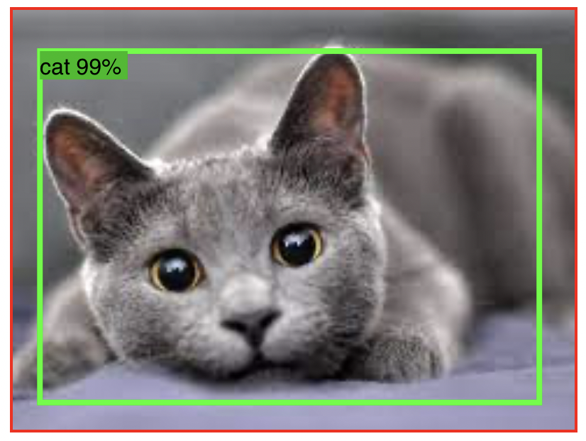

# AI-Lab

AI-lab is a set of components and tools built on TensorFlow JS for React and React Native!

## Requirements

The packages in this repository require Node v14+.

## Quick Look

<center>

| App                                           | Web                                           |
| --------------------------------------------- | --------------------------------------------- |
|  |  |

</center>

## Examples


### _AILabImage_

```tsx
import React from 'react';
import { AILabImage } from 'ai-lab';

const MyAIComponent = ({ src }) => {
  return <AILabImage perf perfCallback={perf => console.log(perf)} src={src} />;
};
```

### _Properties_

| Prop         | Type                                      | Description                         |
| ------------ | ----------------------------------------- | ----------------------------------- |
| perf         | boolean                                   | Display performance metrics overlay |
| prefCallback | (perfInfo: PerfInfo) => Promise<PerfInfo> | Get performance metrics in callback |
| src          | string                                    | URI to image file                   |

<br>

## Installation


coming soon

<br>

## Contributing

Working within this repository requires Node v14. A Node Version Manager is recommended, such as [`nvm`](https://github.com/nvm-sh/nvm#installing-and-updating).

This repository is a monorepo, and managed by [`pnpm`](https://pnpm.io). To install it, run:

```console
$ npm install pnpm -g
```

From the repository root directory, run the following command to install all dependencies:

```console
$ pnpm install
```

Once install completes, development can begin.

### _Stacks we use_ :

[tsdx](https://tsdx.io/)

[storybook](https://storybook.js.org/)

[pnpm](https://pnpm.io/)

<br>

  
#### ⁉️ If you run into problems, first search the issues in this repository. Otherwise you can <a href="https://github.com/infinitered/ai-lab/issues">report the bug</a>.
